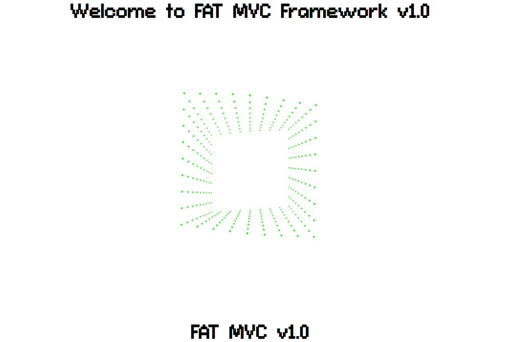
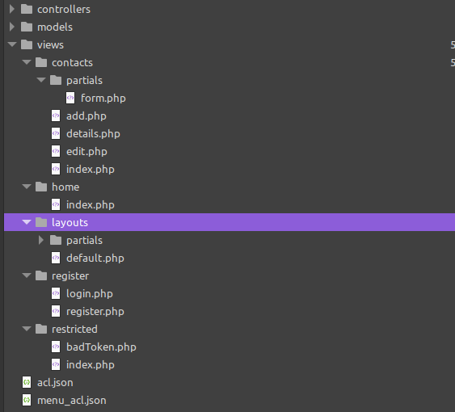
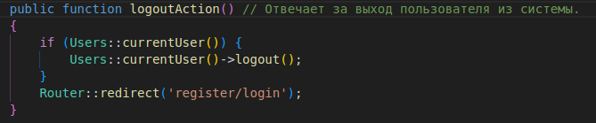
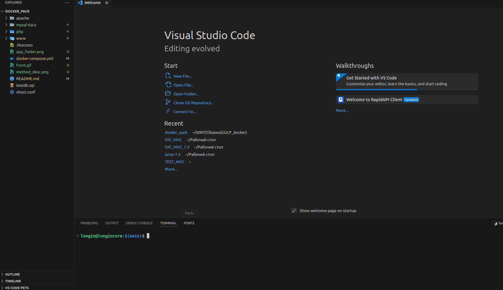

# FAT MVC FRAMEWORK v1.1
Фреймворк представляет собой компиляцию рабочей среды для разработки веб-приложений, состоящей из:
#### 1. Docker (Apache + PHP-FPM, PHP 7.4.33, MySQL и PHPMYADMIN).
#### 2. Таск раннер Gulp.
#### 3. JS-библиотека JQuery.
#### 4. CSS-фреймворк Bootstrap.
#### 5. Слайдер Splide.
**Важно! По умолчанию все библиотеки включены в файле ``head.php``, если вы не хотите их использовать - просто удалите соответствующие строки.**

**Update v.1.1: обновление Apache с v1.1 на v2.0, после запуска удалите из адресной строки порт.**


Проект реализован в парадигме ООП, в качестве паттерна проектирования (как видно из названия) используется *[Model-View-Controller](https://habr.com/ru/articles/150267/)*.

Не претендует на какие-либо истины и регалии, создан в попытке облегчить жизнь себе и кому-нибудь еще.


## Оглавление

1. [Структура корневой папки](#структура-корневой-папки)
2. [Папка www и ее содержимое](#папка-www-и-ее-содержимое)
3. [Папка dev и ее содержимое](#папка-dev-и-ее-содержимое)
4. [Инициализация и начало работы](#инициализация-и-начало-работы)
5. [Запуск и управление контейнерами](#запуск-и-управление-контейнерами)
6. [Запуск и управление процессом разработки](#запуск-и-управление-процессом-разработки)
7. [Демо](#демо)
8. [PS](#ps)

## Структура корневой папки

**``apache/``** - папка, содержащая Dockerfile с устанавливаемыми модулями для apache.

**``php/``** - папка, содержащая Dockerfile с настройками и предварительной установкой пакетов для PHP.

**``www/``** - основная папка проекта, описывается далее.

**``docker-compose.yml``** - файл описывает устанавливаемые для Docker пакеты.

**``testdb.sql``** - файл базы данных MySQL, содержащий прописанные по умолчанию таблицы:  

**users** - для хранения пользователей.     
**contacts** - для хранения записей в условной адресной книге.    
**user_sessions** - хранит сессию пользователя, в случае, если галочка **remember_me** при авторизации установлена.
Для демонстранции в базе уже есть следующая учетная запись:

Логин: ``admin``    
Пароль: ``1111`` 

**Не забудьте импортировать файл базы данных перед началом работы!**    
После успешной установки БД в корне проекта Вы увидите папку ``mysql-data``.

**``vhost.conf``** - файл настроек для apache.

**``.htaccess``** - дополнительные настройки apache. В частности описание RewriteEngine.

***

## Папка ``www`` и ее содержимое
**``dev/``** - здесь содержится проект в "сыром" виде(файлы не оптимизированы / не минифицированы), содержимое описывается далее.

**``out/``** - сюда компилируются файлы проекта. Выходная папка фреймворка, содержащая конечное веб-приложение (без учета БД).
Уже содержит в себе папку **``images/``** с файлом анимации начальной заставки.

**``eslint.config.mjs``** - файл с минимальным набором правил для линтера *[ESLint](https://eslint.org/)*.

**``gulpfile.js``** - файл с настройками *[Gulp](https://gulpjs.com/)*.

Для работы со стилями используются SCSS и различные плагины для преобразования, объединения и оптимизации CSS файлов. JavaScript обрабатывается с помощью *[Babel](https://babeljs.io/)* для обеспечения совместимости со старыми браузерами.

Также включает в себя инструменты для минификации и сжатия ресурсов, такие как изображения и шрифты. Присутствуют утилиты для создания спрайтов SVG и конвертации форматов изображений.

Для удобства разработки реализована синхронизация с браузером для отслеживания изменений в коде real-time и система уведомлений о завершении задач. Линтеры помогают придерживаться определенного стиля написания кода.

**``package.json``** - файл содержит список устанавливаемых пакетов для *[Gulp](https://gulpjs.com/)*.

**``webpack.config.js``** - файл с настройками *[Webpack](https://webpack.js.org/)*.

Особенности webpack:
Раздельные конфигурации для продакшена и разработки позволяют оптимизировать сборку под разные среды.
В продакшен-версии используется минификация кода через TerserPlugin.
В режиме разработки включены source-map для лучшей отладки.
BannerPlugin добавляет информацию о файле в начало каждого обработанного файла в режиме разработки.
По умолчанию в **``gulpfile.js``** используется режим разработки.

**``.stylelintrc.json``** - файл с минимальным набором правил для линтера *[Stylelint](https://stylelint.io/)*.
**``.stylelintignore``** - файл со списком игнорируемых типов файлов *[Stylelint](https://stylelint.io/)*.


## Папка ``dev`` и ее содержимое
**``index.php``** - "точка входа" в приложение, содержит в себе автозагрузчик классов (и не только), а так-же вызывает метод маршрутизатора. 

**``app/``** - содержит дочерние классы "ядра" приложения, которые использует тестовый проект (разворачивающийся при первом запуске), а также json-файлы, содержащие в себе **A**ccess **C**ontrol **L**ist для доступа к меню на разных уровнях и список его пунктов.

Папки **``controllers/``**, **``models/``** и **``views/``** хранят в себе контроллеры, модели и представления соответственно.



К каждому реализованному методу написано краткое описание его функционала.



**``config/config.php``** - содержит базовые настройки сайта и все переменные, использующиеся в проекте.

**``core/``** - содержит все базовые классы, "ядро" фреймворка. У каждого метода в файлах также есть краткое описание.

**``core/validators/``** - содержит в себе базовые валидаторы для обработчиков форм.

**``css/``** - содержит в себе минифицированные стили для *[Bootstrap](https://getbootstrap.com/)* и *[Splide](https://splidejs.com/)*.

**``fonts/src/``** - папка для конвертации файлов шрифтов (сюда помещаются исходники в формате ``ttf``, на выходе в получаем ``woff2``).

**``images/src/``** - папка для оптимизации изображений, список поддерживаемых форматов описан в ``gulpfile.js``.

**``js/``** - содержит файлы библиотек *[Bootstrap](https://getbootstrap.com/)*, *[Splide](https://splidejs.com/)* и *[JQuery](https://jquery.com/)*.

**``js/components/``** - содержит файлы ``_functions.js``, ``_vars.js``, ``_main.js`` для пользовательских функций, переменных и основного кода соответственно.

**``media/``**  - папка для хранения медиафайлов (по умолчанию в ``gulpfile.js``) прописаны только **mp3**.

**``scss/``** - папка для хранения стилей. 

**``style.scss``** - основной файл, в который по умолчанию импортируются все остальные.

**``_defaults.scss``** - файл со стилями по умолчанию для базового проекта (как то - ширина ограничительного контейнера, размер и семейство базового шрифта, прижатие футера к низу страницы и т.д.)

**``_fonts.scss``** - файл, в который через директиву ```@incliude``` импортируются пользовательские шрифты.

**``_footer.scss``** - файл для "подвала" проекта.

**``_header.scss``** - файл для "шапки" проекта.

**``_media.scss``** - файл для медиа-запросов.

**``_mixins.scss``** - файл для хранения "примесей". По умолчанию уже хранит в себе миксина для быстрого добавления / использования шрифтов, а так-же градиентов.

**``_normalize.scss``** - файл нормализации, версия 8.0.1.

**``_vars.scss``** - файл для хранения переменных.

При разработке проекта, компилируемый на выходе **``style.min.css``** хранит в себе стили из всех вышеперечисленных файлов в неминифицированном виде. Отдельным файлом создается **style.min.css.map**, содержащий в себе карты стилей, полученные с помощью плагина *[gulp-sourcemaps](https://www.npmjs.com/package/gulp-sourcemaps)*.


## Инициализация и начало работы
Для начала работы со сборкой следует скопировать содержимое репозитория на компьютер с помощью команды:


```git clone https://github.com/Longin89/DockerPack.git```

и после этого в папке сборки выполнить команду:

```docker-compose build```

чтобы скачать и установить все необходимые образы.

## Запуск и управление контейнерами
После установки Вы можете управлять контейнерами с помощью следующих команд:

Запустить контейнеры:

- `docker-compose up -d`

Остановить контейнеры:
- `docker-compose stop`

Остановить и удалить контейнеры:
- `docker-compose down`

Просмотреть журналы контейнеров:
- `docker-compose logs`

Показать статус контейнеров:
- `docker-compose ps`

Войти в файловую систему контейнера:
- `docker exec -it -i <container_name> /bin/bash`

## Запуск и управление процессом разработки
После запуска докера Вам нужно перейти с помощью командной строки перейти в папку ``www`` и установить зависимости ``Gulp`` с помощью команд :

``cd www/``

``npm i``

Остальные зависимости устанавливаем с помощью команды:

``gulp depends``

Данная команда скопирует в папку **``out/``** все шрифты, стили библиотек, js-файлы, картинки и файл ``.htaccess``.

После этого можно запустить сборку с помощью команды:

``gulp``

Фреймворк готов к работе.

**Внимание! Если вместо превоначального экрана Вы увидете ошибку - обновите страницу!**


## Демо




## PS

В случае возникновения любых вопросов или проблем - просьба писать в issues.
С радостью рассмотрю идеи по рефакторингу кода.