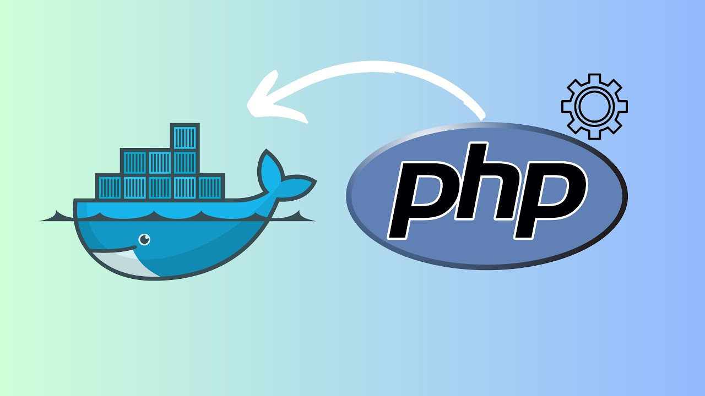

# Docker Pack by EvanLongin version 1.1.!
#### Версия 1.1 : Добавлен autoload в Composer
##### Сборка содержит компиляцию рабочих сред на основе **Docker**, позволяющих осуществлять разработку веб-приложений на основе PHP 5 / 7 / 8, используя в качестве веб-сервера **Apache** или **Nginx**, FPM в роли обработчика процессов, MySql в роли СУБД и PHPMYADMIN в качестве инструмента администрирования баз данных.
[English description](#table-of-contents)


## Оглавление
1. [Структура папок](#структура-папок)
2. [Инициализация и начало работы](#инициализация-и-начало-работы)
3. [Запуск и управление контейнерами](#запуск-и-управление-контейнерами)
4. [Работа с корневой папкой www](#работа-с-корневой-папкой-www)
5. [Работа с Базой данных](#работа-с-базой-данных)


## Структура папок

Так как сборка имеет схожую файловую систему, я опишу структуру папок на примере Apache:

### apache/ - папка разработки на основе Apache &#8594;
#### ./docker_5.4 - Сборка на основе PHP 5.4
#### ./docker_7.4 - Сборка на основе PHP 7.4
#### ./docker_8.2 - Сборка на основе PHP 5.4


### Каждая и обозначенных папок в свою очередь имеет следующую структуру:
#### ./apache - папка с docker-файлом настроек apache
#### ./images - папка с образом php, в нее-же можно устанавливать все последующие образы по необходимости
#### ./mysql-data - папка для хранения баз данных
#### ./www - корневая папка для вашего веб-приложения (уже содержит в себе файлы, о которых будет сказано ниже)
#### ./docker-compose.yml - файл для управления сервисами Docker
#### ./vhost.conf - файл с настройками Apache / Nginx
***


## Инициализация и начало работы
Для начала работы со сборкой следует скопировать содержимое репозитория на компьютер с помощью команды:


```git clone https://github.com/Longin89/DockerPack.git```

и после этого в папке сборки выполнить команду:

```docker-compose build```

чтобы скачать и установить все необходимые образы.

## Запуск и управление контейнерами
После установки Вы можете управлять контейнерами с помощью следующих команд:

Запустить контейнеры:

- `docker-compose up -d`

Остановить контейнеры:
- `docker-compose stop`

Остановить и удалить контейнеры:
- `docker-compose down`

Просмотреть журналы контейнеров:
- `docker-compose logs`

Показать статус контейнеров:
- `docker-compose ps`

Войти в файловую систему контейнера:
- `docker exec -it -i <container_name> /bin/bash`

## Работа с корневой папкой ```www```
Изначально сборка задумывалась как расширение для *[gulpPack](https://github.com/Longin89/gulpPack)*, чтобы иметь возможность заниматься версткой в php-файлах - если Вы преследуете те-же цели, то просто скопируйте содержимое папки ```PHP``` в корень папки ```www``` и далее следуйте инструкциям из *[gulpPack](https://github.com/Longin89/gulpPack)*.
В ином случае так-же, исходные файлы проекта помещайте сюда, После запуска докера они будут доступны по ```localhost```.

**Важно!** В папке уже находятся 3 файла:

`index.php` - проверяет работоспособность PHP (показывает результат ```phpinfo()```):


`db.php` - проверяет работоспособность СУБД (выводит `Connected successfully` в случае успеха)

`composer.json` - файл менеджера пакетов Composer (отсутствует для версии 5.4)


## Работа с Базой данных
Для работы с БД сборка использует связку MySql + PHPMYADMIN. Для проверки работоспособности и удобства в `docker-compose.yml` уже прописано создание тестовой бд, а так-же логина и пароля для нее (их вы можете посмотреть в самом файле, так-же как и для PHPMYADMIN).

В качестве интерфейсов для взаимодействия с БД в Apache-сборку интегрирован `Mysqli`,
а в Nginx - `PDO_MySql`(что подразумевает изменение типа СУБД по Вашему желанию при необходимости)


# Docker Pack by EvanLongin version 1.1!

#### Version 1.1: Added autoload to Composer
##### The pack contains a compilation of working environments based on **Docker**, allowing the development of web applications based on PHP 5 / 7 / 8, using **Apache** or **Nginx** as a web server , FPM as a process handler, MySql as a DBMS and PHPMYADMIN as a database administration tool.


## Table of contents
1. [Folder structure](#folder-structure)
2. [Initialization and getting started](#initialization-and-getting-started)
3. [Launching and managing containers](#launching-and-managing-containers)
4. [Working with the root folder www](#working-with-the-root-folder-www)
5. [Working with the Database](#working-with-the-database)


## Folder structure

Since the packs has a similar file system, I will describe the folder structure using Apache as an example:

### apache/ - development folder based on Apache &#8594;
#### ./docker_5.4 - Build based on PHP 5.4
#### ./docker_7.4 - Build based on PHP 7.4
#### ./docker_8.2 - Build based on PHP 5.4


### Each designated folder in turn has the following structure:
#### ./apache - folder with an apache settings
#### ./images - folder with the php image, you can also install all subsequent images in it if necessary
#### ./mysql-data - folder for storing databases
#### ./www - the root folder for your web application (already contains the files that will be discussed below)
#### ./docker-compose.yml - file for managing Docker services
#### ./vhost.conf - file with Apache / Nginx settings
***


## Initialization and getting started
To start working with the pack, copy the contents of the repository to your computer using the command:


```git clone https://github.com/Longin89/DockerPack.git```

choose version and then run the command in the build folder:

```docker-compose build```

to download and install all the necessary images.

## Launching and managing containers
After installation, you can manage containers using the following commands:

Launch containers:

- `docker-compose up -d`

Stop containers:
- `docker-compose stop`

Stop and remove containers:
- `docker-compose down`

View container logs:
- `docker-compose logs`

Show container status:
- `docker-compose ps`

Enter to container`s filesystem:
- `docker exec -it -i <container_name> /bin/bash`


## Working with the root folder ```www```
Initially, the pack was intended as an extension for *[gulpPack](https://github.com/Longin89/gulpPack)*, in order to be able to do layout in PHP files - if you are pursuing the same goals, then just copy the contents of the  `PHP` folder to the root of the ```www``` folder and then follow the instructions from *[gulpPack](https://github.com/Longin89/gulpPack)*.
Otherwise, place the project source files here. After running Docker, they will be available via ```localhost```.

**Important!** The folder already contains 3 files:

`index.php` - checks the functionality of PHP (shows the result of ```phpinfo()```):


`db.php` - checks the functionality of the DBMS (prints `Connected successfully` if successful)

`composer.json` - Composer package manager file (missing for version 5.4)


## Working with the Database
To work with the database, the pack uses the MySql + PHPMYADMIN combination. To check functionality and convenience, `docker-compose.yml` already specifies the creation of a test database, as well as a login and password for it (you can see them in the file itself, just like for PHPMYADMIN).

`Mysqli` is integrated into the Apache assembly as interfaces for interacting with the database,
and in Nginx - `PDO_MySql` (which means changing the DBMS type according to your desire, if necessary)